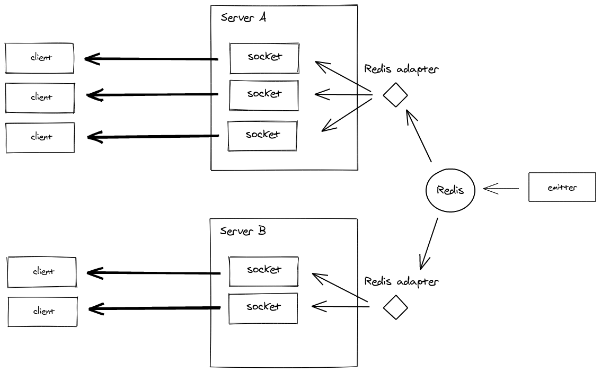

# :construction: Kotlin Socket-Redis Adapter

This library allows you to easily publish notifications via `socket.io` from your kotlin backend. This is currently
under construction and not production ready yet.

It must be used in conjunction with socket.io-redis. The current version is only tested with socket.io-redis@6 and
socket.io@4.

The emitter is also available in other programming languages:

- Java: https://github.com/sunsus/socket.io-java-emitter
- Python: https://pypi.org/project/socket.io-emitter/
- PHP: https://github.com/rase-/socket.io-php-emitter
- Golang: https://github.com/yosuke-furukawa/socket.io-go-emitter
- Perl: https://metacpan.org/pod/SocketIO::Emitter
- Rust: https://github.com/epli2/socketio-rust-emitter

## :bookmark_tabs: Table of content

- [Architecture](#architecture)
- [Getting Started](#getting-started)
    * [Gradle Import](#gradle-import)
    * [Emit Cheatsheet](#emit-cheatsheet)
    * [Example](#example)
- [Limitations](#limitations)

## :green_book: Architecture



## :running: Getting Started

### Gradle Import

```groovy
repositories {
    mavenCentral()
}

dependencies {
    implementation "de.smartsquare:socket-io-redis-emitter:0.12.0"
}
```

This library comes with a default implementation for both jedis and lettuce.

### Emit Cheatsheet

```kotlin
val emitter = Emitter(JedisPublisher(jedis))

// Publishing a simple text message
emitter.broadcast(topic = "something", value = "Hello World!")

// Publishing a complex object is only supported as a map for now.
val payload = mapOf("name" to "deen", "online" to true, "age" to 23)
emitter.broadcast(topic = "something", value = payload)
```

### Serialization with Jackson

The `Emitter` uses Jackson internally to convert payloads. It is by default configured to produce valid messages, but
can be overridden:

```kotlin
// This is the default used in the Emitter. Adjust to your needs.
val myObjectMapper = ObjectMapper(MessagePackFactory())
    .findAndRegisterModules()
    .disable(SerializationFeature.WRITE_DATES_AS_TIMESTAMPS) /* Does not work without for date times 
                                                                with high precision. */

// Construct as before but additionally with the ObjectMapper above.
val emitterWithCustomObjectMapper = Emitter(JedisPool("localhost"), namespace = "/", objectMapper = myObjectMapper)

emitter.broadcast(topic = "something", value = "Hello World!")
```

### Example

The [example](example) directory contains a working docker-compose setup which can be started
using `docker-compose --compatibility up`. The setup contains one redis instance, one java publisher, three
socket.io-servers and three consuming socket.io-clients.

### Usage in Spring Boot and Jedis

Jedis:
```kotlin
@Bean
fun emitter(redisConnectionFactory: RedisConnectionFactory): Emitter {
    val jedisConnectionFactory = redisConnectionFactory as JedisConnectionFactory
    val jedisConnection = jedisConnectionFactory.connection as JedisConnection
    return Emitter(JedisPublisher(jedisConnection.jedis))
}
```

## :warning: Limitations

- The room and namespaces have not been tested yet.
